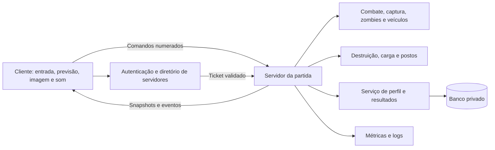

# Arquitetura técnica proposta

## Direção e escolha de rede

Cliente Windows em Unity 6.3 LTS com URP; servidor dedicado Linux sem renderização, um processo por partida. A versão é recomendada pela janela de suporte publicada pela [Unity](https://unity.com/releases/unity-6). Fixar patch e pacotes depois da prova de compatibilidade.

Primeira candidata: Netcode for Entities, Unity Transport, Entities, Burst e Unity Physics em versões compatíveis. A Unity descreve Entities como solução com autoridade do servidor e previsão do cliente; a escolha combina com alta contagem de entidades, mas exige domínio de DOTS. Não é garantia de suportar 100 pessoas. [Comparação oficial dos netcodes](https://docs.unity.com/en-us/multiplayer/netcode/netcode).

Provar movimento, tiro, colisão, veículo e ingresso tardio antes de firmar a escolha. Se a equipe não conseguir manter a base DOTS, comparar uma solução orientada a GameObjects com previsão documentada e carga equivalente. Não trocar de rede no meio da produção sem registrar custo e resultado de medição. Não adicionar NGO e Entities como duas autoridades da mesma partida.

## Responsabilidades

O servidor valida movimento, cadência, munição, dano, compra, coleta, entrega, construção e pontuação. O cliente transmite intenção; nunca transmite um saldo ou dano para ser aceito diretamente. Credenciais de backend não entram no executável do jogador. Começar com conexão direta em rede de teste; autenticação real entra antes do playtest público.

Módulos previstos: Bootstrap/Build, Session, Character, Combat, Vehicles, Capture, Inventory, Logistics, Construction, Destruction, Zombies, Presentation e Telemetry. Cada módulo separa dados, simulação e apresentação. IDs estáveis identificam objetos do mapa; definições de armas/receitas são versionadas e validadas pelo servidor.

## Sincronização

- Previsão e reconciliação para o personagem local; interpolação dos remotos. Veículos usam autoridade do servidor e exigem prova específica de previsão do motorista.
- Tiro validado contra histórico limitado de posições; decidir na prova técnica como considerar coberturas que foram destruídas. Nunca permitir voltar indefinidamente no tempo para aceitar um disparo.
- Estado persistente da partida usa snapshots; eventos pontuais têm sequência e deduplicação. Um RPC de explosão não substitui o estado final da parede.
- Ingresso tardio recebe configuração, versão, baseline da região e mudanças posteriores. Testar reconexão enquanto a destruição continua.
- Interesse espacial: priorizar entidades próximas e relevantes, com margem para atiradores, som e aeronaves. Objetos distantes recebem atualização reduzida. No centro lotado, aceitar que muitos jogadores serão relevantes simultaneamente; esse é o cenário de teste obrigatório.
- Não replicar partículas, estilhaços cosméticos, animação completa ou áudio amostrado. O cliente reconstrói efeitos a partir de eventos.

Referência de implementação: [Ghosts and snapshots](https://docs.unity3d.com/Packages/com.unity.netcode@1.10/manual/ghost-snapshots.html). A versão 1.10 é referência de pesquisa, não seleção antecipada de pacote para o projeto.

## Destruição com impacto real

| Sistema | Estado autoritativo | Apresentação local |
|---|---|---|
| Árvore | ID, saúde, queda, orientação final, colisão do tronco | Folhas, poeira e lascas |
| Parede/prédio | Módulos intactos/rompidos e suportes essenciais | Fragmentos pequenos e transição visual |
| Cratera | Célula, variante/profundidade limitada, revisão da colisão | Material e partículas |
| Posto | Estrutura, estoque, dano e habilitação de respawn | Indicadores e efeitos |

Prédios usam módulos preparados e um grafo simples de suporte; remover suporte dispara estados de colapso definidos. Grandes destroços que fornecem cobertura permanecem sincronizados; pequenos fragmentos desaparecem por orçamento. Aplicar mudanças de colisão em lotes e limitar colapsos simultâneos.

Crateras não serão apenas decals: a prova deve alterar superfície e colisão de uma área preparada e permitir observar seu efeito em jogador e veículo. Usar terreno dividido em células, com variantes de malha ou deformação limitada. Excluir túneis e escavação voxel livre. Servidor distribui parâmetros e versão da célula; cliente reconstrói a mesma superfície. Definir limite inicial de 64 células alteradas por partida; ao atingir o limite, bloquear novas alterações físicas de maneira previsível e medir a necessidade de ampliar.

Colisões que afetam gameplay precisam concordar em cliente e servidor. Não assumir que fragmentos físicos simulados independentemente cairão no mesmo lugar. Identificar antes da produção se cada objeto pertence a Unity Physics ou à física de GameObjects; duplicar autoridade entre os dois mundos é um risco a eliminar no protótipo.

## Navegação dos infectados

Começar com navegação pré-calculada e decisões apenas no servidor. Uma ponte explícita pode usar consultas NavMesh e agentes limitados no servidor para alimentar entidades; validar custo e integração com Unity Physics antes de escalar. Não presumir que NavMeshAgent roda como job Burst ou que usa automaticamente colisores ECS.

Separar alterações que apenas bloqueiam passagem das que criam novo piso. Obstáculos podem bloquear rotas; crateras e pisos removidos exigem atualização da superfície ou conexões preparadas. Reconstruir apenas regiões afetadas, com fila e orçamento, mantendo o infectado parado/recalculando enquanto a rota estiver inválida. A documentação de [NavMesh Surface](https://docs.unity3d.com/Packages/com.unity.ai.navigation@2.0/manual/NavMeshSurface.html) orienta seleção de geometria e tiles; integração com destruição é responsabilidade nossa.

IA completa só perto de jogadores. Fora disso, representar atividade de forma simplificada, sem causar dano por entidades inexistentes. Limites experimentais: 30 ativos no recorte, depois cenários de 60 e 120. Nem 120 nem qualquer outro número será prometido até ser medido com jogadores e destruição juntos.

## Persistência e exploração de falhas

Estoque, compras, veículos, postos e destruição vivem na partida. Inicialmente não há riqueza permanente que afete poder. Perfil guarda preferências, cosméticos e estatísticas aprovadas. Persistência futura passa por serviço interno e banco privado; não escrever banco a cada frame.

Entrega usa transição atômica: carga disponível → entregue → recompensa registrada, identificada por operação única. Retry de rede não duplica recompensa. Resultado de partida tem ID único e gravação idempotente. Validar distância, posse, equipe, capacidade e fase da partida em cada transação. Testar desconexão no meio da entrega e comando repetido.

Proteção inicial: validação no servidor, limites de comando, autorização administrativa, logs de ações e denúncia/mute. Avaliar anti-cheat adicional antes do teste público; autoridade do servidor não elimina aimbot ou leitura indevida de dados.

## Metas para medir

Orçamento inicial: simulação a 30 ticks/s, janela de 33,3 ms. Meta p95 de trabalho por tick abaixo de 25 ms e p99 abaixo de 33,3 ms no servidor escolhido, sem backlog sustentado. Previsão pode reexecutar ticks; medir custo também no cliente. Cadência de snapshots começa em 15–20/s e será ajustada.

Meta cliente: 60 FPS em 1080p no hardware de referência que vier a ser definido; publicar também frame time p95, pausas e memória. Testar latência de ida e volta de 50/100/150 ms, jitter e perda de 1–3%; requisitos de tiro e reconciliação precisam ser avaliados com pessoas.

Matriz de carga: 12 → 30 → 60 → 100 conexões reais de protocolo. Bots apenas dentro do servidor não validam banda, serialização nem sincronização. Geradores externos reproduzem movimento, combate, transporte, construção e reconexão. Testar 100 no centro, colapso, hordas e ingresso tardio simultâneos.

Registrar build, máquina, cenário, duração, p50/p95/p99 do tick, CPU por núcleo, RAM, pausas de GC, tráfego por cliente e divergências. Gate inicial de 100: duas horas de teste sintético completo e depois sessões com jogadores reais. Se falhar, reduzir custos/limites ou aumentar recursos; manter a capacidade pública no último número comprovado.
